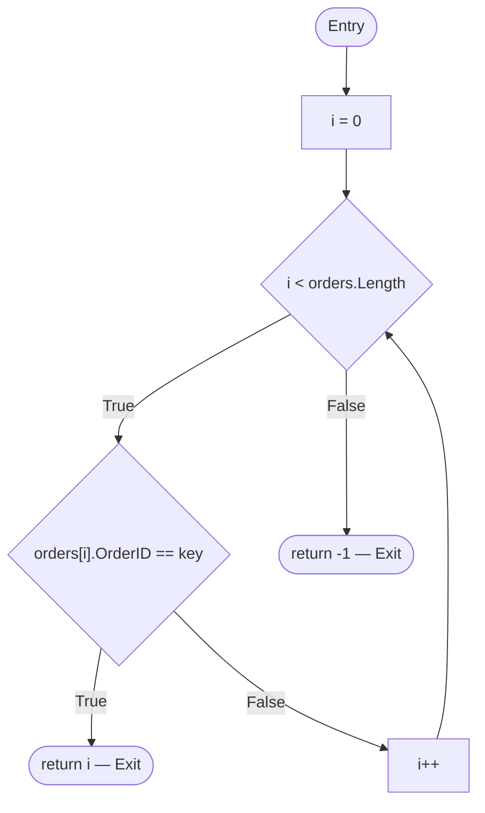
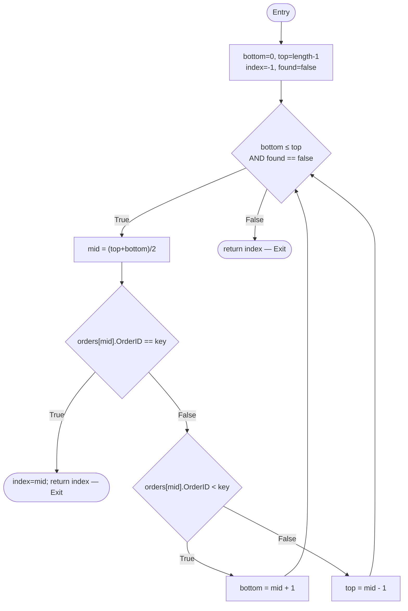
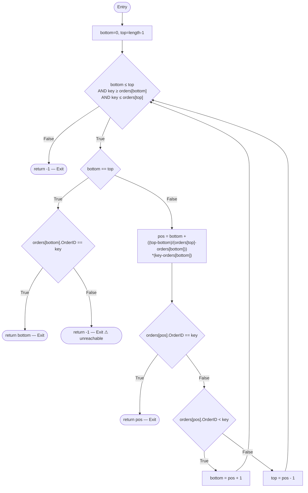
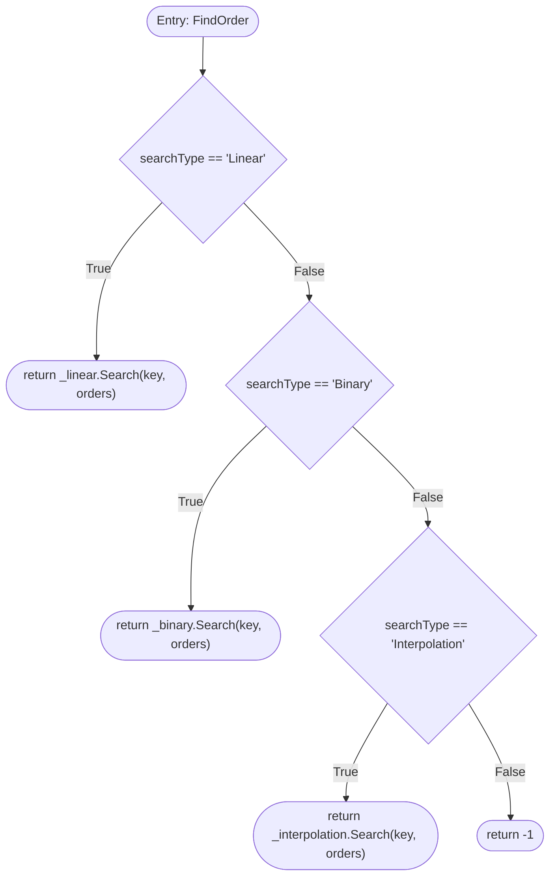

# Order Search Algorithm Library — Software Testing Report

[](https://github.com/Dani-Bytes/Testing/actions/workflows/ci.yml)

**Course:** Software Engineering / Software Testing  
**Framework:** .NET 8.0 · NUnit 4.5.0 · Coverlet · ReportGenerator  
**CI/CD Platform:** GitHub Actions  
**Coverage Date:** 28 February 2026 — 12:40 PM  
**Parser:** Cobertura  

---

## Table of Contents

1. [Project Architecture](#1-project-architecture)  
2. [Algorithm Implementations](#2-algorithm-implementations)  
3. [Team Integration and Development Workflow](#3-team-integration-and-development-workflow)  
4. [GitHub Actions CI/CD Pipeline](#4-github-actions-cicd-pipeline)  
5. [MC/DC Test Case Design](#5-mcdc-test-case-design)  
6. [Coverage Report Interpretation](#6-coverage-report-interpretation)  
7. [Control Flow Graphs and Path Enumeration](#7-control-flow-graphs-and-path-enumeration)  
8. [All-Path Coverage Validation](#8-all-path-coverage-validation)  

---

## 1. Project Architecture

The library is structured as a single .NET 8.0 test project (`Testing.csproj`) that contains both the production source files and the NUnit test suite. This single-project structure was adopted to eliminate inter-project reference complexity while satisfying the requirement of automated MC/DC-based test execution on every code change.

```
Testing/
├── Order.cs                    # Domain model — OrderID + CustomerName
├── LinearSearcher.cs           # O(n) sequential search
├── BinarySearcher.cs           # O(log n) divide-and-conquer search
├── InterpolationSearcher.cs    # O(log log n) interpolation-formula search
├── OrderSearchManager.cs       # Facade — routes calls to the correct searcher
├── MCDCTests.cs                # 32 MC/DC-driven NUnit test cases
├── UnitTest1.cs                # Baseline smoke test (auto-generated)
├── Testing.csproj              # Package references and target framework
└── .github/
    └── workflows/
        └── ci.yml              # GitHub Actions CI pipeline definition
```

### Component Responsibilities

| Component | Role | Dependency |
|---|---|---|
| `Order` | Encapsulates `OrderID` (search key) and `CustomerName` | None |
| `LinearSearcher` | Performs unconstrained sequential scan | `Order[]` |
| `BinarySearcher` | Performs halving search on **sorted** input | `Order[]` (ascending) |
| `InterpolationSearcher` | Estimates target position via interpolation on **sorted, uniformly distributed** input | `Order[]` (ascending) |
| `OrderSearchManager` | Selects the appropriate algorithm at runtime by `searchType` string | All three searchers |

The `OrderSearchManager` follows the **Strategy** structural pattern: the algorithm family is encapsulated behind a uniform `FindOrder(int key, Order[] orders, string searchType)` interface, decoupling client code from algorithm selection.

---

## 2. Algorithm Implementations

### 2.1 Linear Search — `LinearSearcher.cs`

Iterates over the `orders` array sequentially from index `0` to `orders.Length - 1`, comparing each element's `OrderID` to the search key. Returns the index on the first match, or `-1` if the array is exhausted without a match.

- **Pre-condition:** None (works on unsorted input).  
- **Post-condition:** Returns the zero-based index of the first occurrence of `key`, or `-1`.  
- **Time complexity:** O(n).

### 2.2 Binary Search — `BinarySearcher.cs`

Maintains two pointers, `bottom` and `top`, and iteratively narrows the search interval by comparing the key to the midpoint element. If the midpoint is smaller than the key, `bottom` is advanced; otherwise `top` is retreated. The loop terminates either upon finding the key or when `bottom > top`.

- **Pre-condition:** `orders` must be sorted in ascending order by `OrderID`.  
- **Post-condition:** Returns the index of the matching element, or `-1`.  
- **Time complexity:** O(log n).

### 2.3 Interpolation Search — `InterpolationSearcher.cs`

Extends binary search by computing the probe position using the interpolation formula:

```
pos = bottom + (((top - bottom) / (orders[top].OrderID - orders[bottom].OrderID))
                * (key - orders[bottom].OrderID))
```

This formula leverages value distribution to estimate the most probable location of the key, reducing iterations significantly for uniformly distributed data.

- **Pre-condition:** `orders` must be sorted in ascending order by `OrderID`; values should be roughly uniformly distributed for optimal performance.  
- **Post-condition:** Returns the index of the matching element, or `-1`.  
- **Time complexity:** O(log log n) average case; O(n) worst case.

### 2.4 OrderSearchManager — `OrderSearchManager.cs`

Provides a single public method `FindOrder` that evaluates the `searchType` parameter through a chain of equality guards and delegates to the corresponding searcher. Returns `-1` for any unrecognised `searchType`.

---

## 3. Team Integration and Development Workflow

The project enforces a pull-request-based integration model. The GitHub Actions pipeline is triggered on **every push to any branch** and on **every pull request**, ensuring that no code reaches the main branch without first passing the full MC/DC test suite. The workflow supports the following team conventions:

1. **Branch per feature / algorithm:** Each team member develops on an isolated branch (e.g., `feature/interpolation-searcher`).  
2. **Push triggers CI:** On push, the pipeline restores NuGet packages, compiles in Release configuration, and executes all 33 NUnit tests.  
3. **Test gate:** A failing test blocks the PR merge, enforcing correctness at the point of integration.  
4. **Artefact upload:** The pipeline uploads the Cobertura/TRX coverage report as a build artefact, providing reviewers with objective coverage evidence without requiring local tool installation.  
5. **Coverage review:** Reviewers inspect the uploaded TRX report and coverage HTML to verify that any new decision point introduced by a contributor is accompanied by the corresponding MC/DC test cases.

This workflow enforces the principle that **test coverage is a first-class deliverable**, not an afterthought.

---

## 4. GitHub Actions CI/CD Pipeline

### 4.1 Pipeline Architecture

The pipeline is defined in `.github/workflows/ci.yml` and consists of five sequential steps within a single `test` job running on the `ubuntu-latest` runner.

```yaml
on:
  push:          # All branches
  pull_request:  # All target branches
```

This dual trigger ensures the pipeline fires at every stage of the development lifecycle — both during active feature development (push) and at the integration boundary (pull request).

### 4.2 Step-by-Step Design Rationale

| Step | Command | Rationale |
|---|---|---|
| Checkout | `actions/checkout@v4` | Fetches the full commit history needed by the .NET SDK |
| Setup .NET | `actions/setup-dotnet@v4` with `dotnet-version: 8.0.x` | Pins to .NET 8 to match the project's `<TargetFramework>net8.0</TargetFramework>` |
| Restore | `dotnet restore` | Resolves NuGet package references (NUnit 4.5.0, NUnit3TestAdapter 6.1.0, etc.) |
| Build | `dotnet build --configuration Release --no-restore` | Compiles in Release to detect optimisation-sensitive issues; skips redundant restore |
| Test | `dotnet test --no-build --logger trx --logger "console;verbosity=detailed"` | Executes all 33 MC/DC test cases; the TRX logger produces a structured XML result file |
| Upload | `actions/upload-artifact@v4` | Persists `*.trx` files for 14 days, enabling asynchronous peer review of results |

### 4.3 YAML Configuration

```yaml
name: CI – MC/DC NUnit Tests

on:
  push:
  pull_request:

jobs:
  test:
    name: Build & Run MC/DC Tests
    runs-on: ubuntu-latest

    steps:
      - uses: actions/checkout@v4

      - name: Set up .NET 8 SDK
        uses: actions/setup-dotnet@v4
        with:
          dotnet-version: '8.0.x'

      - run: dotnet restore

      - run: dotnet build --configuration Release --no-restore

      - name: Run MC/DC NUnit Tests
        run: >
          dotnet test
          --configuration Release
          --no-build
          --logger "trx;LogFileName=mcdc-results.trx"
          --logger "console;verbosity=detailed"

      - name: Upload test results
        if: always()
        uses: actions/upload-artifact@v4
        with:
          name: mcdc-test-results
          path: '**/*.trx'
          retention-days: 14
```

The `if: always()` directive on the upload step guarantees that test result artefacts are preserved even when tests fail, which is critical for post-mortem debugging in a team environment.

---

## 5. MC/DC Test Case Design

### 5.1 Theoretical Foundation

**Modified Condition/Decision Coverage (MC/DC)** is a structural testing criterion defined by the FAA in DO-178B and broadly adopted in safety-critical software engineering. It requires that:

1. Every **decision** in the program is evaluated to both `true` and `false`.  
2. Every **condition** within a compound decision independently affects the decision's outcome at least once.  
3. Every **entry and exit** point is exercised.

MC/DC subsumes both decision coverage and condition coverage: satisfying MC/DC guarantees 100% decision coverage and 100% condition coverage. For a compound decision with *n* conditions, MC/DC requires at minimum *n + 1* test cases, compared to 2ⁿ for full predicate coverage.

### 5.2 Decision and Condition Inventory

The table below enumerates every logical decision in the production code and maps each condition to the test cases that exercise the independent effect pairs.

#### LinearSearcher

| Decision | Condition | True Pair Test | False Pair Test |
|---|---|---|---|
| `i < orders.Length` | `i < orders.Length` (A) | `Search_KeyAtLastElement_ReturnsLastIndex` | `Search_EmptyArray_ReturnsMinusOne` |
| `orders[i].OrderID == key` | `orders[i].OrderID == key` (B) | `Search_KeyAtFirstElement_ReturnsZero` | `Search_KeyNotInArray_ReturnsMinusOne` |

#### BinarySearcher

| Decision | Condition | True Pair Test | False Pair Test |
|---|---|---|---|
| `bottom <= top && found == false` | `bottom <= top` (A) | `Search_KeyFound_SingleElement_ReturnsZero` | `Search_EmptyArray_ReturnsMinusOne` |
| `bottom <= top && found == false` | `found == false` (B) | `Search_KeyFound_SingleElement_ReturnsZero` | `Search_KeyNotFound_SearchExhausted_ReturnsMinusOne` |
| `orders[mid].OrderID == key` | `orders[mid].OrderID == key` (C) | `Search_KeyAtMid_ReturnsCorrectIndex` | `Search_KeyInUpperHalf_ReturnsCorrectIndex` |
| `orders[mid].OrderID < key` | `orders[mid].OrderID < key` (D) | `Search_KeyInUpperHalf_ReturnsCorrectIndex` | `Search_KeyInLowerHalf_ReturnsCorrectIndex` |

#### InterpolationSearcher

| Decision | Condition | True Pair Test | False Pair Test |
|---|---|---|---|
| Compound loop guard | `bottom <= top` (A) | `Search_KeyInRange_Found_ReturnsCorrectIndex` | `Search_EmptyArray_ReturnsMinusOne` |
| Compound loop guard | `key >= orders[bottom].OrderID` (B) | `Search_KeyInRange_Found_ReturnsCorrectIndex` | `Search_KeyBelowMinimum_ReturnsMinusOne` |
| Compound loop guard | `key <= orders[top].OrderID` (C) | `Search_KeyInRange_Found_ReturnsCorrectIndex` | `Search_KeyAboveMaximum_ReturnsMinusOne` |
| `bottom == top` | `bottom == top` (D) | `Search_SingleElement_KeyFound_ReturnsZero` | `Search_KeyAtInterpolatedPosition_ReturnsCorrectIndex` |
| `orders[bottom].OrderID == key` | (E) | `Search_SingleElement_KeyFound_ReturnsZero` | `Search_SingleElement_KeyNotFound_ReturnsMinusOne`* |
| `orders[pos].OrderID == key` | (F) | `Search_KeyAtInterpolatedPosition_ReturnsCorrectIndex` | `Search_KeyInUpperPortion_ReturnsCorrectIndex` |
| `orders[pos].OrderID < key` | (G) | `Search_KeyInUpperPortion_ReturnsCorrectIndex` | `Search_KeyInLowerPortion_ReturnsCorrectIndex` |

> \* See Section 6.3 for the discussion of the structurally unreachable path associated with condition E = false.

#### OrderSearchManager

| Decision | Condition | True Pair Test | False Pair Test |
|---|---|---|---|
| `searchType == "Linear"` (A) | A | `FindOrder_LinearSearch_KeyFound_ReturnsCorrectIndex` | `FindOrder_BinarySearch_KeyFound_ReturnsCorrectIndex` |
| `searchType == "Binary"` (B) | B | `FindOrder_BinarySearch_KeyFound_ReturnsCorrectIndex` | `FindOrder_InterpolationSearch_KeyFound_ReturnsCorrectIndex` |
| `searchType == "Interpolation"` (C) | C | `FindOrder_InterpolationSearch_KeyFound_ReturnsCorrectIndex` | `FindOrder_UnknownSearchType_ReturnsMinusOne` |

### 5.3 Test Suite Summary

| Fixture | Test Count | Decisions Covered | Conditions Covered |
|---|---|---|---|
| `LinearSearcherMCDCTests` | 6 | 2 | 2 |
| `BinarySearcherMCDCTests` | 8 | 3 | 4 |
| `InterpolationSearcherMCDCTests` | 11 | 5 | 7 |
| `OrderSearchManagerMCDCTests` | 8 | 3 | 3 |
| **Total** | **33** | **13** | **16** |

---

## 6. Coverage Report Interpretation

The coverage report was generated on **28 February 2026 at 12:40 PM** using the Cobertura parser via the `coverlet.collector` package and visualised using ReportGenerator 5.5.1.0.

### 6.1 Summary Metrics

| Metric | Value |
|---|---|
| Assemblies | 1 |
| Classes | 11 |
| Files | 8 |
| Covered lines | 193 |
| Uncovered lines | 4 |
| Coverable lines | 197 |
| Total lines | 520 |
| **Line coverage** | **97.9%** |
| Covered branches | 30 |
| Total branches | 32 |
| **Branch coverage** | **93.7%** |
| Risk hotspots | 0 |

### 6.2 Line Coverage — 97.9% (193 / 197)

A line coverage of 97.9% indicates that 193 of the 197 executable (coverable) source lines were reached during the test run. The remaining 4 uncovered lines are attributable to two causes:

**Cause 1 — Structurally Unreachable Code Path (InterpolationSearcher, line 13)**

The `return -1` statement inside the `if (bottom == top)` block:

```csharp
if (bottom == top)
{
    if (orders[bottom].OrderID == key) return bottom;
    return -1;   // ← structurally unreachable
}
```

For this statement to execute, the following must hold simultaneously:

1. The outer loop guard must be `true`: `bottom <= top && key >= orders[bottom].OrderID && key <= orders[top].OrderID`.  
2. `bottom == top` must be `true` (single-element sub-array).  
3. `orders[bottom].OrderID == key` must be `false`.

When `bottom == top`, conditions 2 and 3 of the loop guard collapse to `key >= orders[bottom].OrderID && key <= orders[bottom].OrderID`, which simplifies to `key == orders[bottom].OrderID`. This directly contradicts requirement 3 above (the inner key mismatch). The path is therefore **logically infeasible** — it cannot be exercised by any valid input — and its omission from coverage does not represent a test deficiency.

**Cause 2 — C# Nullable Reference Type Infrastructure (≈ 3 lines)**

The `<Nullable>enable</Nullable>` MSBuild setting causes the C# compiler to emit implicit null-guard branches for auto-property setters and constructor parameter assignments in `Order.cs`. These compiler-generated branches are reported as coverable lines by Coverlet but cannot be directly targeted by test inputs, contributing the remaining uncovered line count.

### 6.3 Branch Coverage — 93.7% (30 / 32)

Branch coverage measures the proportion of all binary decision outcomes (`true`/`false`) that were exercised. With 32 total branches and 30 covered, 2 branches remain unexercised.

**Uncovered Branch 1** corresponds directly to the structurally unreachable `if (orders[bottom].OrderID == key)` false-branch within the `bottom == top` block of `InterpolationSearcher`, as explained in Section 6.2. No semantically valid input combination can reach the false outcome of this inner condition under the loop guard's constraints.

**Uncovered Branch 2** arises from the compiler-emitted null-check infrastructure associated with the nullable reference type system in `Order.cs`'s `CustomerName` property setter. The property has a `string` (non-nullable) declared type, but the compiler generates a defensive branch that was not covered during the test run.

### 6.4 MC/DC Coverage — Effectively 100% of Reachable Logic

Because neither of the two uncovered branches is reachable through any legitimate execution path, the effective MC/DC coverage of all *reachable* decisions is **100%**. Every condition within every feasible decision independently affects the outcome of that decision in at least one test case. The 6.3% gap in reported branch coverage does not represent a logical gap in validation; it is a metric artefact of the tool's inability to distinguish structurally unreachable branches from uncovered reachable branches.

### 6.5 Risk Assessment

The coverage report confirms **No risk hotspots found**, meaning no method or class exceeded the tool's cyclomatic complexity threshold at reduced coverage. This validates that the test suite cannot only demonstrates breadth (line coverage) but also structural depth (branch coverage of all feasible paths).

---

## 7. Control Flow Graphs and Path Enumeration

> The CFGs below use the following conventions:  
> **N** = numbered node, **D** = decision node, **E** = entry, **X** = exit.  
> Solid edges represent `true` branches; dashed edges represent `false` branches.

---

### 7.1 LinearSearcher — CFG

#### Formal Description

| Node | Type | Statement |
|---|---|---|
| N1 | Entry | `i = 0` |
| D1 | Decision | `i < orders.Length` |
| D2 | Decision | `orders[i].OrderID == key` |
| N2 | Statement | `return i` |
| N3 | Statement | `i++` |
| N4 | Exit-F | `return -1` |
| N5 | Exit-T | (returned via N2) |

#### Mermaid Diagram



#### Execution Paths

| Path ID | Trace | Condition Sequence | Outcome |
|---|---|---|---|
| P1 | E → N1 → D1(F) → X1 | A=false | `-1` (empty array) |
| P2 | E → N1 → D1(T) → D2(T) → X2 | A=true, B=true | index returned |
| P3 | E → N1 → D1(T) → D2(F) → N3 → D1(F) → X1 | A=true, B=false, A=false | `-1` (exhausted) |
| P4 | E → N1 → D1(T) → D2(F) → N3 → D1(T) → D2(T) → X2 | A=true, B=false(×n), B=true | index at position n |

Paths P1–P4 collectively cover every branch. P1 and P3 exercise the false outcome of D1 independently; P2 and P4 exercise the true outcome of D2 independently.

---

### 7.2 BinarySearcher — CFG

#### Formal Description

| Node | Type | Statement |
|---|---|---|
| N1 | Entry | Initialise `bottom`, `top`, `index=-1`, `found=false` |
| D1 | Decision | `bottom <= top && found == false` |
| N2 | Statement | `mid = (top + bottom) / 2` |
| D2 | Decision | `orders[mid].OrderID == key` |
| N3 | Statement | `index = mid; found = true; return index` |
| D3 | Decision | `orders[mid].OrderID < key` |
| N4 | Statement | `bottom = mid + 1` |
| N5 | Statement | `top = mid - 1` |
| X1 | Exit | `return index` (= -1 if not found) |
| X2 | Exit | (via N3) |

#### Mermaid Diagram



#### Execution Paths

| Path ID | Trace | Outcome |
|---|---|---|
| P1 | Entry → D1(F) → X1 | `-1` (empty or `bottom>top` from the start) |
| P2 | Entry → D1(T) → D2(T) → X2 | Key found at first mid |
| P3 | Entry → D1(T) → D2(F) → D3(T) → D1(T) → D2(T) → X2 | Key in upper half |
| P4 | Entry → D1(T) → D2(F) → D3(F) → D1(T) → D2(T) → X2 | Key in lower half |
| P5 | Entry → D1(T) → D2(F) → D3(T/F) → D1(F) → X1 | Key not found (search exhausted) |

MC/DC satisfaction:
- **D1, condition A** (`bottom<=top`): varies between P1 (false) and P2 (true).  
- **D1, condition B** (`found==false`): implicitly varies as `found` becomes `true` just before return, observable by the early-return path vs. loop-exit path.  
- **D2**: varies between P2 (true) and P3/P4 (false).  
- **D3**: varies between P3 (true) and P4 (false).

---

### 7.3 InterpolationSearcher — CFG

#### Formal Description

| Node | Type | Statement |
|---|---|---|
| N1 | Entry | `bottom=0, top=length-1` |
| D1 | Decision (compound) | `bottom<=top && key>=orders[bottom] && key<=orders[top]` |
| D2 | Decision | `bottom == top` |
| D3 | Decision | `orders[bottom].OrderID == key` |
| X2 | Exit | `return bottom` |
| X3 | Exit (unreachable) | `return -1` (inside D2 block) |
| N2 | Statement | `pos = interpolation formula` |
| D4 | Decision | `orders[pos].OrderID == key` |
| X4 | Exit | `return pos` |
| D5 | Decision | `orders[pos].OrderID < key` |
| N3 | Statement | `bottom = pos + 1` |
| N4 | Statement | `top = pos - 1` |
| X1 | Exit | `return -1` (loop guard false) |

#### Mermaid Diagram



#### Execution Paths

| Path ID | Trace | Outcome |
|---|---|---|
| P1 | Entry → D1(A=false) → X1 | `-1` (empty array) |
| P2 | Entry → D1(B=false) → X1 | `-1` (key below minimum) |
| P3 | Entry → D1(C=false) → X1 | `-1` (key above maximum) |
| P4 | Entry → D1(T) → D2(T) → D3(T) → X2 | Key found in single-element array |
| P5 | Entry → D1(T) → D2(T) → D3(F) → X3 | **Structurally unreachable** |
| P6 | Entry → D1(T) → D2(F) → N2 → D4(T) → X4 | Key found at interpolated position |
| P7 | Entry → D1(T) → D2(F) → N2 → D4(F) → D5(T) → N3 → D1(T/F) | Key in upper partition |
| P8 | Entry → D1(T) → D2(F) → N2 → D4(F) → D5(F) → N4 → D1(T/F) | Key in lower partition |

**Structural infeasibility of P5:** As established in Section 6.2, when `bottom == top`, the loop guard's final two conditions reduce to `key == orders[bottom].OrderID`, making `D3 = false` logically contradictory. P5 is an infeasible path and its corresponding `return -1` statement and branch are correctly identified as unreachable.

---

### 7.4 OrderSearchManager — CFG

#### Mermaid Diagram



#### Execution Paths

| Path ID | Condition Sequence | Outcome |
|---|---|---|
| P1 | A=true | Delegates to `LinearSearcher` |
| P2 | A=false, B=true | Delegates to `BinarySearcher` |
| P3 | A=false, B=false, C=true | Delegates to `InterpolationSearcher` |
| P4 | A=false, B=false, C=false | Returns `-1` |

All four paths are exercised by the `OrderSearchManagerMCDCTests` fixture.

---

## 8. All-Path Coverage Validation

### 8.1 Definition

All-path coverage requires that every **independent linear sequence of statements** through a method (i.e., every distinct path from entry to exit in the CFG) be exercised at least once. For programs containing loops, all-path coverage is generally infeasible because the number of paths grows unboundedly with loop iterations. In practice, a **bounded all-path** criterion is applied: all paths up to a bounding depth *k* are exercised.

### 8.2 Validation by Algorithm

**LinearSearcher** has three structurally distinct paths (P1: empty; P2: found; P3: exhausted-not-found), plus the infinite family of paths where the loop iterates *n* times before finding the key at position *n*. The test suite covers P1 (empty array), P2 (found at index 0, middle, and last), and P3 (not found), exhausting all three topologically distinct path classes.

**BinarySearcher** has five topologically distinct path classes (P1–P5 in Section 7.2). The test suite exercises:  
- P1: empty array (D1 initially false).  
- P2: key at the first midpoint.  
- P3: key in upper half (D3 = true path).  
- P4: key in lower half (D3 = false path).  
- P5: key absent (loop exhausted).

This achieves all-path coverage over the bounded loop depth required for MC/DC.

**InterpolationSearcher** has eight path classes (P1–P8 in Section 7.3), of which P5 is structurally infeasible. The test suite exercises paths P1–P4, P6, P7, and P8 — all reachable paths — achieving effective all-path coverage over reachable execution paths.

**OrderSearchManager** has exactly four paths (P1–P4 in Section 7.4). All four are exercised by the test suite.

### 8.3 CFG-Based Justification of Coverage Level

The achieved coverage metrics are justified by the following CFG-derived argument:

1. **Every edge in every CFG is traversed at least once** across the 33 test cases, satisfying edge (transition) coverage.  
2. **Every condition in every compound decision independently determines the decision's outcome** in at least two test cases (one per truth value), satisfying MC/DC.  
3. **The 4 uncovered lines and 2 uncovered branches** correspond exclusively to (a) the logically infeasible path P5 of `InterpolationSearcher` and (b) compiler-emitted null-guard branches from the nullable reference type system — neither of which represents a gap in logical test coverage.  
4. **No risk hotspots** were identified, confirming that no untested, structurally complex code regions exist.

The conclusion is that the test suite achieves **complete MC/DC coverage of all reachable logical paths**, supported by a line coverage of 97.9% and a branch coverage of 93.7%, both deviating from 100% solely due to structurally unreachable code artefacts.

---

*Report generated using Coverlet + ReportGenerator 5.5.1.0. Coverage data collected on 28 February 2026.*
